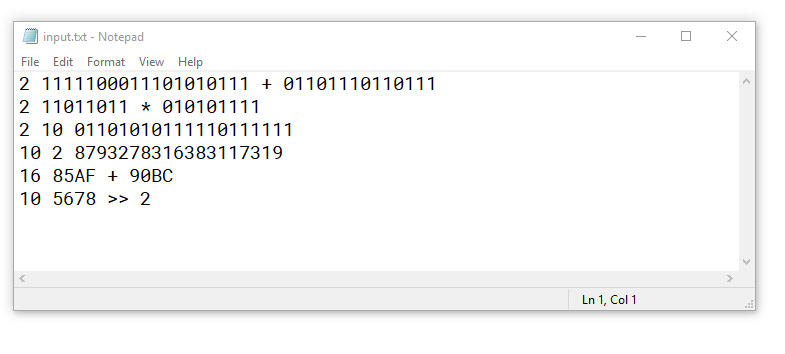
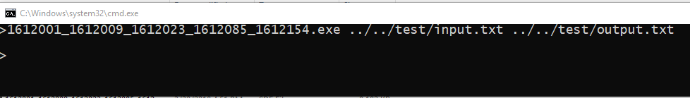
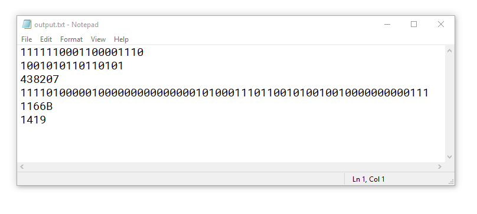

# <center>BIỂU DIỄN SỐ NGUYÊN LỚN 128 BITS</center>

## MỤC TIÊU
* Đọc file chứa các số nguyên lớn 128 bits và các phép toán
* Thực hiện các phép toán và logic trên số nguyên lớn 128bits
* Trả các kết quả về file

## CÁCH SỬ DỤNG
**1. File input bao gồm nhiều dòng, mỗi dòng:**
* ```[Cơ số] [Số thứ nhất] [Số thứ hai] ``` (Tính toán 2 số)
* ```[Cơ số 1] [Cơ số 2] [Số thuộc hệ cớ số 1] ``` (Chuyển đổi từ hệ cơ số 1 sang cơ số 2)


**2. Vào thư mục Debug, chạy command line với argument vào theo thứ tự là:**

	[đường dẫn file input] [đường dẫn file output]


**3. Kết quả sẽ nằm ở file output vừa nhập**


## ĐÁNH GIÁ MỨC ĐỘ HOÀN THÀNH

**STT** | **MỤC ĐÁNH GIÁ** 			| **MỨC ĐỘ(%)**
:---	|---						|---:
1		|Lưu trữ trên đúng 16 bytes	|100%
2		|Nhập và xuất				| 90%
3		|Các phép toán đại số 		|100%
4		|Các phép toán logic		|100%
5		|Chuyển đổi cơ số 			|100%
6		|Dịch trái dịch phải		|100%
7		|Biểu diễn số âm			|100%
8		|Xử lý lỗi logic và đại số 	| 10%
9		|Đọc ghi file bằng cmd		|100%
10		|Source code và document rõ ràng |80%
**Tổng cộng** 						||**88%**

## TÀI LIỆU THAM KHẢO

* [Chuong02_BieuDienSoNguyen](../Report/Ch02_Bieu-dien-so-nguyen.pdf)