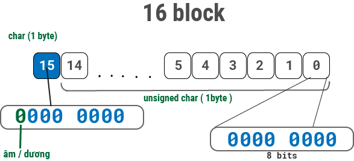
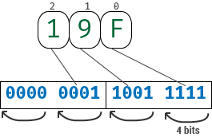
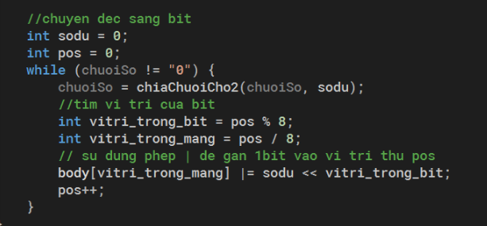

# 
DOCUMENT

## SƠ LƯỢC VỀ BIỂU DIỄN SỐ NGUYÊN
### 1. Hệ cơ số tổng quát
* Số nguyên có n chữ số thuộc hệ cơ số q bất kỳ được biểu diễn:
	* **$x_{n-1}...x_{1}x_{0} = x_{n-1}.q^{n-1} + ... + x_{0}.q^{0}$**
* Ví dụ:
	* Hệ cơ số 10: A = 123 = $100 + 20 + 3$
	* Hệ cơ số 2: A = 123 = $2^{6}+2^{5}+2^{4}+2^{3}+ 0.2^{2} + 2^{1} + 2^{0} = 1111011_{2}$
	* Hệ cơ số 16: A = 123 = $7*16^{1}+11*16^{0} = 7B_{16}$

## CÁCH THỨC BIỂU DIỄN SỐ NGUYÊN 16 bytes CỦA CHƯƠNG TRÌNH

* Sử dụng mảng 16 kí tự (mỗi kí tự 1 byte) để biểu diễn số nguyên lớn
* Mỗi kí tự là 8 bits, tổng cộng mảng 16 kí tự là 128 bits
* Bit đầu tiên dùng làm bit dấu (dấu lượng)
* Biểu diễn số âm theo nguyên tắc bù 2 và bias (quá k = 128bit)

## CÁC PHƯƠNG PHÁP ĐỌC VÀO TỪ CHUỖI
* Do số nguyên 16 byte quá lớn, nên ta chỉ có thể đọc vào từ chuỗi
* Ta cần phải chuyển chuỗi đưa vào thành dữ liệu số vào đem lưu vào mảng 16 block trên
* Ta có 3 cách để đọc vào từ chuỗi:

### Đọc chuỗi cơ số 2 (binary)

### Đọc chuỗi cơ số 16 (hex)

### Đọc chuỗi cơ số 10
